# RVS_Checkbox

- **Table of Contents**
    - [INTRODUCTION](#INTRO)
    - [WHAT PROBLEM DOES THIS SOLVE?](#WHATPROBLEM)
        - [So, What's the Problem?](#WHATSTHEPROBLEM)
        - [Why Does the RVS_Checkbox Solve This Problem?](#WHY)
    - [REQUIREMENTS](#REQUIREMENTS)
    - [DEPENDENCIES](#DEPENDENCIES)
    - [INSTALLATION](#INSTALLATION)
        - [Swift Package Manager](#SPM)
            - [Adding the Package Directly to One Target](#SINGLETARGET)
            - [Adding the Package Directly to Another Target](#ADDITIONALTARGET)
        - [AFTER INCLUDING THE PACKAGE OR LIBRARY](#AFTER)
        - [Carthage](#CARTHAGE)
        - [Directly Accessing the GitHub Repo](#GITHUBREPO)
    - [DOCUMENTATION](#DOCUMENTATION)
    - [USAGE](#USAGE)
        - [Setup](#SETUP)
            - [Interface Builder](#IB)
            - [Dynamic Instantiation](#DYNAMIC)
        - [Options](#OPTIONS)
            - [Three-State (Default OFF)](#THREE-STATE)
            - [Use SF Symbols (Default OFF)](#SF-SYMBOLS)
            - [Use OFF Image for CLEAR (Default OFF)](#OPTION-OFF-CLEAR)
            - [Use Haptics (Default ON)](#HAPTICS)
            - [Images](#IMAGES)
            - [Checkbox State](#STATE)
        - [NOT SUPPORTED](#NOT-SUPPORTED)
        - [THE TEST HARNESS APP](#TEST)
            - [App Build Targets](#TARGETS)
            - [App Run Schemes](#SCHEMES)
            - [Dependencies and Requirements](#TEST-DEP)

## <a id="INTRO"></a>INTRODUCTION
This project is a robust, Swift-only, high-quality, "drop-in replacement" for the traditional [`UISwitch`](https://developer.apple.com/documentation/uikit/uiswitch), provided by Apple. It derives from [`UIControl`](https://developer.apple.com/documentation/uikit/uicontrol), and provides almost exactly the same API as [`UISwitch`](https://developer.apple.com/documentation/uikit/uiswitch).

It is implemented as [a single source file](https://github.com/RiftValleySoftware/RVS_Checkbox/blob/main/Sources/RVS_Checkbox/RVS_Checkbox.swift), with no dependencies.

Integrating into your application is as simple as adding a [`UIView`](https://developer.apple.com/documentation/uikit/uiview) in [Interface Builder](https://developer.apple.com/xcode/interface-builder/https://developer.apple.com/xcode/interface-builder/), and specifying it to be [`RVS_Checkbox`](https://github.com/RiftValleySoftware/RVS_Checkbox), or creating an instance of [`RVS_Checkbox`](https://github.com/RiftValleySoftware/RVS_Checkbox).

## <a id="WHATPROBLEM"></a>WHAT PROBLEM DOES THIS SOLVE?
The classic [`UISwitch`](https://developer.apple.com/documentation/uikit/uiswitch):


Is a great UI element, and is used in place of the classic ["checkbox"](https://developer.apple.com/documentation/appkit/nsbutton) for Mac:


Which doesn't actually work as well, in the "fat finger" world of iOS UI.
### <a id="WHATSTHEPROBLEM"></a>So, What's the Problem?
The issue is that the [`UISwitch`](https://developer.apple.com/documentation/uikit/uiswitch) is a big, rather awkwardly-shaped element. It is "lozenge"-shaped, and always horizontal, so can require a bit of creativity, when it comes to fitting it into a UI. Also, it has a specific design aesthetic, and can be difficult to customize *(to be fair, Apple doesn't encourage us to customize **ANY** UI, so that's no surprise).*

Because of the horizontal aspect of the control, it is fairly "natural" to have the label to the left:


...or the right:


But it looks "awkward" to have it below the switch:


This is especially true, if you use "label buttons," like I do (run the test harness, to see them in action).
It is also a bit "weird," as the slider appearance seems to ask for a swipe gesture, as opposed to a tap gesture (which is really what we want). That means that the gesture also requires some "mental runway."
The `RVS_Checkbox` allows a square aspect, and a directionless (tap) action, like a regular checkbox.

[`UISwitch`](https://developer.apple.com/documentation/uikit/uiswitch) also has a strictly "binary" action. If you have three choices, you are expected to use a [`UISegmentedControl`](https://developer.apple.com/documentation/uikit/uisegmentedcontrol), which is actually quite sensible. Apple obviously put a lot of research into their UX, and there's a good reason for this. Mobile interfaces are a compromise, at best.

### <a id="WHY"></a>Why Does the RVS_Checkbox Solve This Problem?
Glad you asked. The `RVS_Checkbox` comes with two "built-in" appearances: A default, circular checkbox, and a fairly "classic" appearance that uses the built-in [SF Symbols](https://developer.apple.com/design/human-interface-guidelines/sf-symbols/overview/) to mimic the way the Mac checkboxes appear.

You can also add your own images.

Images are simple. They are always rendered in ["template" mode](https://developer.apple.com/documentation/uikit/uiimage/renderingmode/alwaystemplate), so they are "silhouettes," and are colored by the control's tint.

Additionally, `RVS_Checkbox` brings the "three-state" checkbox that is found in the Mac, to iOS. That means it is possible to have an "OFF," "ON," and "indeterminate" mode (I call it "CLEAR"). The default appearence is the circular checkbox, and the default mode is "binary," like [`UISwitch`](https://developer.apple.com/documentation/uikit/uiswitch).

Here are what the images look like (the color is controlled by the [`tintColor` property](https://developer.apple.com/documentation/uikit/uiview/1622467-tintcolor) of the control):
<table style="text-align:center">
    <thead>
        <tr>
            <td>&nbsp;</td>
            <td><strong>DEFAULT</strong></td>
            <td><strong>SF SYMBOLS</strong></td>
            <td><strong>USER-PROVIDED</strong></td>
        </tr>
    </thead>
    <tbody>
    <tr>
        <td><strong>ON</strong></td>
        <td></td>
        <td></td>
        <td></td>
    </tr>
    <tr>
        <td><strong>OFF</strong></td>
        <td></td>
        <td></td>
        <td></td>
    </tr>
    <tr>
        <td><strong>CLEAR</strong></td>
        <td>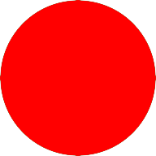</td>
        <td></td>
        <td>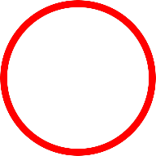</td>
    </tr>
    </tbody>
</table>

The "DEFAULT" and "SF SYMBOLS" images are "baked into" the class, and the "USER-PROVIDED" images are three arbitrary images that were added in the storyboard (you can see these in the test harness).

The images will resize with the control, and will scale to fill (so the control needs to be sized to the aspect ratio of the images, for undistorted display).

## <a id="REQUIREMENTS"></a>REQUIREMENTS

`RVS_Checkbox` is an [iOS](https://apple.com/ios)/[iPadOS](https://apple.com/ipados)-only [`UIKit`](https://developer.apple.com/documentation/uikit)/[Cocoa Touch](https://developer.apple.com/library/archive/documentation/General/Conceptual/DevPedia-CocoaCore/Cocoa.html) [framework](https://developer.apple.com/library/archive/documentation/MacOSX/Conceptual/BPFrameworks/Concepts/WhatAreFrameworks.html) [UIControl](https://developer.apple.com/documentation/uikit/uicontrol), designed for use by [Swift](https://swift.org) language applications.

It is designed for native Swift iOS application development.

This requires [iOS](https://apple.com/ios)/[iPadOS](https://apple.com/ipados) version 13.0 or above.

## <a id="DEPENDENCIES"></a>DEPENDENCIES

There are no dependencies for the module. If you will be running [the test harness](https://github.com/RiftValleySoftware/RVS_Checkbox/tree/main/TestHarness/RVS_Checkbox_TestHarness), you will need to load [the RVS_Generic_Swift_Toolbox project](https://github.com/RiftValleySoftware/RVS_Generic_Swift_Toolbox), as well. Again, **THIS IS NOT NECESSARY TO USE THE PACKAGE. IT IS ONLY FOR THE TEST HARNESS!**

## <a id="INSTALLATION"></a>INSTALLATION

The control is provided as a [Swift Package Manager](https://swift.org/package-manager/) package, and can be installed using [Carthage](https://github.com/Carthage/Carthage). You can also simply drag [the project](https://github.com/RiftValleySoftware/RVS_Checkbox/tree/main/RVS_Checkbox.xcodeproj) into your own project, straight from a local repo, or even just include [the single source file](https://github.com/RiftValleySoftware/RVS_Checkbox/blob/main/Sources/RVS_Checkbox/RVS_Checkbox.swift) (I like to keep the number of source files to a minimum for these types of projects).

### <a id="SPM"></a>Swift Package Manager

The repo that you should include with SPM, is [`git@github.com:RiftValleySoftware/RVS_Checkbox.git`](git@github.com:RiftValleySoftware/RVS_Checkbox.git).

Either by directly editing the [`Package.swift`](https://swift.org/package-manager/#importing-dependencies) file, or by using the project GUI, add the package:

#### <a id="SINGLETARGET"></a>Adding the Package Directly to One Target:

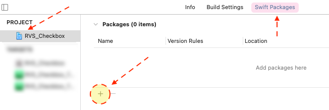

Step 1: In the "Swift Packages" tab of the main project, select the "+" button, to add a package.

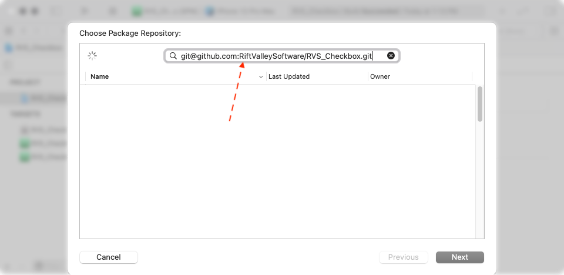

Step 2: In the resulting modal screen, enter the GitHub URI: [`git@github.com:RiftValleySoftware/RVS_Checkbox.git`](git@github.com:RiftValleySoftware/RVS_Checkbox.git).

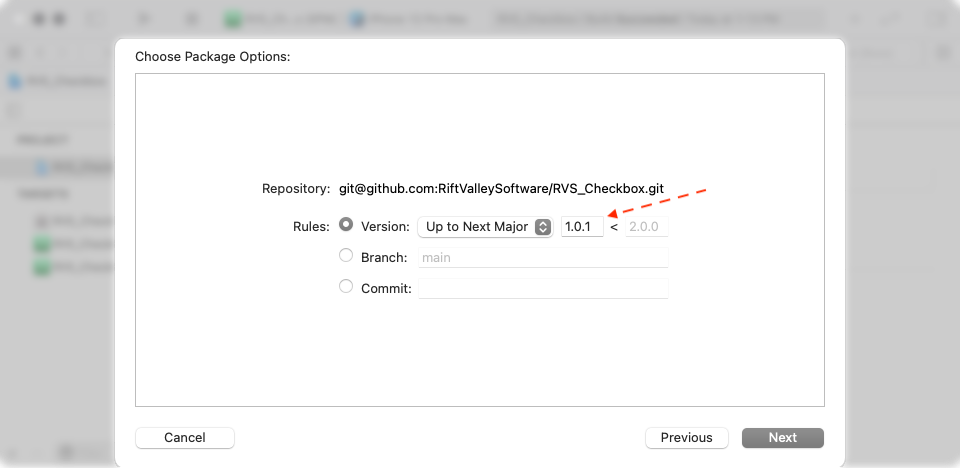

Step 3: Enter the current version (if you used the URI, then this is already set).

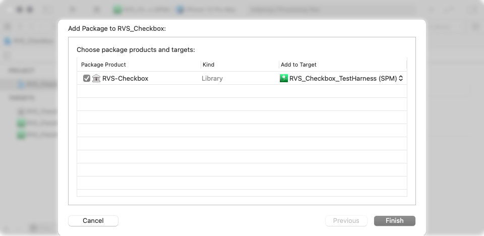

Step 4: Add the package to your target. You can only add the package to one target, at this point.

#### <a id="ADDITIONALTARGET"></a>Adding the Package to Another Target:

If you have the package imported, you now have it available like any other framework, and you can add it manually to any target, using the General Tab:

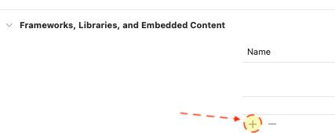

Step 5: Adding the package to a target in the General Tab.

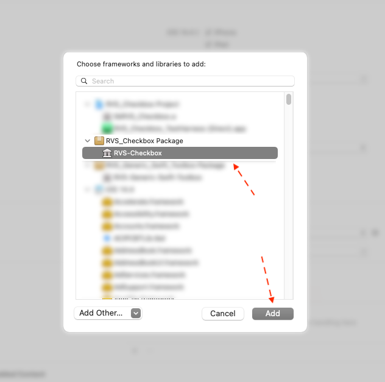

Step 6: Selecting the imported framework.

### <a id="AFTER"></a>AFTER INCLUDING THE PACKAGE OR LIBRARY

At this point, you will need to import the module in the Swift source files that will be accessing it:

```
import RVS_Checkbox
```

### <a id="CARTHAGE"></a>Carthage

If you are using Carthage, then you should add the following line to your Cartfile:

```
github "RiftValleySoftware/RVS_Checkbox"
```

Then, open Terminal, and navigate to the top of the project directory, and type this into Terminal:

```
carthage update
```

It will create a directory at the same level as the Cartfile, called "`Carthage`." Inside of this directory, will be another directory, called "`Checkouts`." Inside of that directory, will be another one, called "`RVS_Checkbox`." You want to go into "`Sources/RVS_Checkout`," and access the `RVS_Checkbox.swift` file. Drag this into your project, and associate it with your app build target.

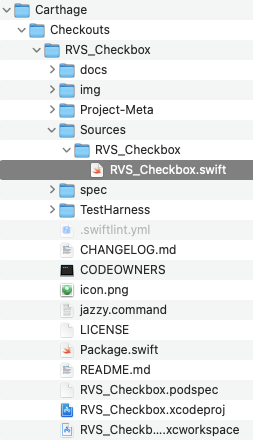

### <a id="GITHUBREPO"></a>Directly Accessing the GitHub Repo

The GitHub repo is [`https://github.com/RiftValleySoftware/RVS_Checkbox`](https://github.com/RiftValleySoftware/RVS_Checkbox).

The Git clone URI is [`git@github.com:RiftValleySoftware/RVS_Checkbox.git`](git@github.com:RiftValleySoftware/RVS_Checkbox.git) (SSH), or [`https://github.com/RiftValleySoftware/RVS_Checkbox.git`](https://github.com/RiftValleySoftware/RVS_Checkbox.git) (HTTPS).

You can access the repo directly, and clone it, or add it as [a Git Submodule](https://git-scm.com/book/en/v2/Git-Tools-Submodules) to your project.

If you do this, be aware that you only need to add one single file to your project; [the `RVS_Checkbox.swift` file](https://github.com/RiftValleySoftware/RVS_Checkbox/blob/main/Sources/RVS_Checkbox/RVS_Checkbox.swift).

It is advisable to directly integrate this file into your project, as opposed to building a library. It is only one source file, and integrating it will be easiest all around.

If we integrate directly, then there is no need to import the module. The `RVS_Checkbox` class will be directly available in the module namespace.

## <a id="DOCUMENTATION"></a>DOCUMENTATION

This README provides the principal documentation, but there is also [a code documentation site](https://riftvalleysoftware.github.io/RVS_Checkbox/) that may be helpful in implementing `RVS_Checkbox`.

## <a id="USAGE"></a>USAGE

In order to use `RVS_Checkbox`, we need to either add it in [Interface Builder](https://developer.apple.com/xcode/interface-builder/https://developer.apple.com/xcode/interface-builder/), or create the instance programmatically.

### <a id="SETUP"></a>Setup

#### <a id="IB"></a>Interface Builder

If we are using [Interface Builder](https://developer.apple.com/xcode/interface-builder/https://developer.apple.com/xcode/interface-builder/) to implement our instance of `RVS_Checkbox`, we start by opening our View Controller up in IB, and pressing the "+" button, in the upper, right corner:

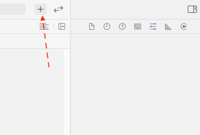

This will open a modal screen, allowing us to select the type of element we wish to add.

We should select a generic[`UIView` (View)](https://developer.apple.com/documentation/uikit/uiview) object:

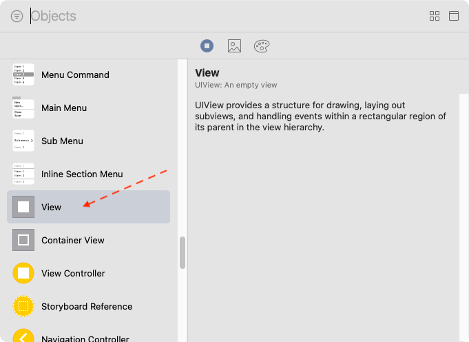

Drag that into the View Controller (1), and arrange it the way that you like. Then select it, and select the Identity Inspector tab. Once that has been selected, enter `RVS_Checkbox` as the object class (2).

If we used Swift Package Manager to add the class, we should set the "`Module`" field to "`RVS_Checkbox`." (3) Otherwise, we should check the "`Inherit Module From Target`" checkbox, and let the app module be chosen.

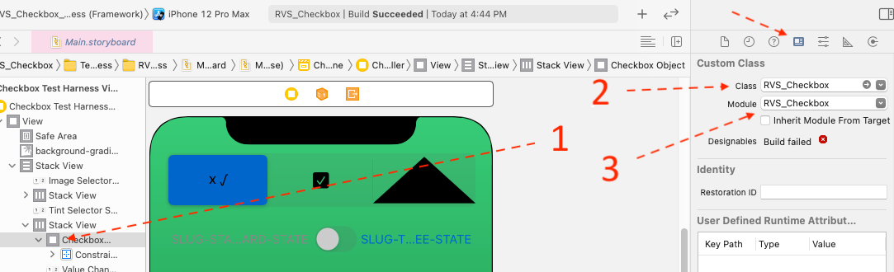

Finally, we should select the Properties Inspector, and set the various inspectable properties to the ones we want to see:

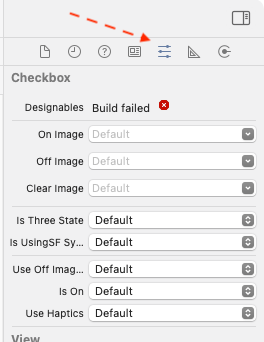

> **_NOTE:_**  As of the writing of this guide, the `IBDesignable` support seems to have issues rendering the control (See the "`Designables Build Failed`" message). I'll be seeing what I can do to address this. It does not prevent the control from working; all it does is prevent it from previewing.

#### <a id="DYNAMIC"></a>Dynamic Instantiation

Dynamic instantiation isn't difficult. Simply create an instance of `RVS_Checkbox`, in the same way we would `UIView`:

```
/* ################################################################## */
/**
 This sets up the three checkboxes along the bottom of the screen.
 
 We set up a center box, using SF Symbols, then add one to its left, using the default, and one to its right, using some custom images.

 We use programmatic Auto-Layout for this.
 */
func setUpDynamicCheckBoxes() {
    if let dynamicContainer = dynamicContainer {    // Make sure we have the container.
        let gap: CGFloat = 8
        let dynamicControlSize: CGFloat = 64
        let testImageFormat = "TestImage-%d"

        let centerDynamicCheckbox = RVS_Checkbox()  // Create the instance
        dynamicContainer.addSubview(centerDynamicCheckbox)  // Add it to the container.
        centerDynamicCheckbox.backgroundColor = .clear      // Nothing behind us (Just to be sure).
        centerDynamicCheckbox.tintColor = checkboxObject?.tintColor // We steal the tint color from the IB-instantiated checkbox.
        centerDynamicCheckbox.isUsingSFSymbols = true
        centerDynamicCheckbox.isThreeState = true
        centerDynamicCheckbox.translatesAutoresizingMaskIntoConstraints = false

        NSLayoutConstraint.activate([
                                    centerDynamicCheckbox.centerXAnchor.constraint(equalTo: dynamicContainer.centerXAnchor, constant: 0),
                                    centerDynamicCheckbox.widthAnchor.constraint(equalToConstant: dynamicControlSize),
                                    centerDynamicCheckbox.heightAnchor.constraint(equalToConstant: dynamicControlSize)
                                    ])
        
        let leftDynamicCheckbox = RVS_Checkbox()
        dynamicContainer.addSubview(leftDynamicCheckbox)
        leftDynamicCheckbox.backgroundColor = .clear
        leftDynamicCheckbox.tintColor = checkboxObject?.tintColor
        leftDynamicCheckbox.isThreeState = true
        leftDynamicCheckbox.translatesAutoresizingMaskIntoConstraints = false
        
        NSLayoutConstraint.activate([
                                    leftDynamicCheckbox.trailingAnchor.constraint(equalTo: centerDynamicCheckbox.leadingAnchor, constant: -gap),
                                    leftDynamicCheckbox.widthAnchor.constraint(equalToConstant: dynamicControlSize),
                                    leftDynamicCheckbox.heightAnchor.constraint(equalToConstant: dynamicControlSize)
                                    ])
        
        let rightDynamicCheckbox = RVS_Checkbox()
        dynamicContainer.addSubview(rightDynamicCheckbox)
        rightDynamicCheckbox.backgroundColor = .clear
        rightDynamicCheckbox.tintColor = checkboxObject?.tintColor
        rightDynamicCheckbox.offImage = UIImage(named: String(format: testImageFormat, 0))
        rightDynamicCheckbox.clearImage = UIImage(named: String(format: testImageFormat, 1))
        rightDynamicCheckbox.onImage = UIImage(named: String(format: testImageFormat, 2))
        rightDynamicCheckbox.isThreeState = true
        rightDynamicCheckbox.translatesAutoresizingMaskIntoConstraints = false
        
        NSLayoutConstraint.activate([
                                    rightDynamicCheckbox.leadingAnchor.constraint(equalTo: centerDynamicCheckbox.trailingAnchor, constant: gap),
                                    rightDynamicCheckbox.widthAnchor.constraint(equalToConstant: dynamicControlSize),
                                    rightDynamicCheckbox.heightAnchor.constraint(equalToConstant: dynamicControlSize)
                                    ])
    }
}
```

The above code snippet was taken [directly from the Test Harness project](https://github.com/RiftValleySoftware/RVS_Checkbox/blob/main/TestHarness/RVS_Checkbox_TestHarness/RVS_Checkbox_TestHarness_ViewController.swift#L426). It shows how we create the three dynamically-instantiated checkboxes on the bottom of the screen.

That results in this display:


### <a id="OPTIONS"></a>Options

There are a number of options available, for customizing the way that the control works.

These are available, both in [Interface Builder](https://developer.apple.com/xcode/interface-builder/https://developer.apple.com/xcode/interface-builder/), or programmatically.

#### <a id="THREE-STATE"></a>Three-State (Default OFF)

[The Documentation for This Option](https://riftvalleysoftware.github.io/RVS_Checkbox/Classes/RVS_Checkbox.html#/c:@M@RVS_Checkbox@objc\(cs\)RVS_Checkbox\(py\)isThreeState)

The control can operate in two modes:

##### <a id="THREE-STATE-OFF"></a>Two-State (Default)

This is the default operation of the checkbox. It has two states: OFF or ON (0 or 1, in value).

##### <a id="THREE-STATE-ON"></a>Three-State

If we set the `useThreeState` checkbox option to ON, then the control has three states: OFF (-1), CLEAR (0), and ON (1). CLEAR can be used as an "indeterminate" state, and is selected between the other two states, when continually actuating the control (OFF-CLEAR-ON, or ON-CLEAR-OFF). 

#### <a id="SF-SYMBOLS"></a>Use SF Symbols (Default OFF)

[The Documentation for this Option](https://riftvalleysoftware.github.io/RVS_Checkbox/Classes/RVS_Checkbox.html#/c:@M@RVS_Checkbox@objc\(cs\)RVS_Checkbox\(py\)isUsingSFSymbols)

If this option is ON (default is OFF), then the control will display images that approximate the Mac checkboxes.

If this is selected, then the "Use OFF Image for CLEAR" option is ignored (as there is a specific way the Mac checkboxes work, and they already do this).

#### <a id="OPTION-OFF-CLEAR"></a>Use OFF Image for CLEAR (Default OFF)

[The Documentation for this Option](https://riftvalleysoftware.github.io/RVS_Checkbox/Classes/RVS_Checkbox.html#/c:@M@RVS_Checkbox@objc\(cs\)RVS_Checkbox\(py\)useOffImageForClear)

If this is selected (default is OFF), then, in either the default appearance, or custom image appearance, the image used for the Three-State "OFF" state is used for Two-State "CLEAR" (also OFF).

This is ignored for Three-State, or if using SF Symbol appearance.

#### <a id="HAPTICS"></a>Use Haptics (DEFAULT ON)

[The Documentation for This Option](https://riftvalleysoftware.github.io/RVS_Checkbox/Classes/RVS_Checkbox.html#/c:@M@RVS_Checkbox@objc\(cs\)RVS_Checkbox\(py\)useHaptics)

By default, the control uses the same subtle haptics that [`UISwitch`](https://developer.apple.com/documentation/uikit/uiswitch) uses. If this is turned OFF, then no haptics are used.

Haptics are not used when setting the value programatically, even if this is ON.

#### <a id="IMAGES"></a>Images

It is possible to override the built-in images, and add your own.

#### <a id="IMAGES-OFF"></a>OFF Image

[The Documentation for This Option](https://riftvalleysoftware.github.io/RVS_Checkbox/Classes/RVS_Checkbox.html#/c:@M@RVS_Checkbox@objc\(cs\)RVS_Checkbox\(py\)offImage)

#### <a id="IMAGES-CLEAR"></a>CLEAR Image

[The Documentation for This Option](https://riftvalleysoftware.github.io/RVS_Checkbox/Classes/RVS_Checkbox.html#/c:@M@RVS_Checkbox@objc\(cs\)RVS_Checkbox\(py\)clearImage)

#### <a id="IMAGES-ON"></a>ON Image

[The Documentation for This Option](https://riftvalleysoftware.github.io/RVS_Checkbox/Classes/RVS_Checkbox.html#/c:@M@RVS_Checkbox@objc\(cs\)RVS_Checkbox\(py\)onImage)

### <a id="STATE"></a>Checkbox State

The checkbox is always in some state: OFF, CLEAR or ON. If in Two-State Mode, then OFF and CLEAR are synonymous.

State is available either through the [`checkboxState`](https://riftvalleysoftware.github.io/RVS_Checkbox/Classes/RVS_Checkbox.html#/s:12RVS_CheckboxAAC13checkboxStateAB6StatesOvp) property (uses [the `RVS_Checkbox.States` enum](https://riftvalleysoftware.github.io/RVS_Checkbox/Classes/RVS_Checkbox/States.html)), or by [the `value` property](https://riftvalleysoftware.github.io/RVS_Checkbox/Classes/RVS_Checkbox.html#/s:12RVS_CheckboxAAC5valueSivp) (Uses Integers -1, 0, or 1). You can modify either one, and the control will change its state *(**NOTE:** Programmatic changes to control state will not send action messages, or trigger haptics)*

[The `value` property](https://riftvalleysoftware.github.io/RVS_Checkbox/Classes/RVS_Checkbox.html#/s:12RVS_CheckboxAAC5valueSivp) allows you to affect the control state, numerically. Negative numbers will be OFF (or CLEAR, if in two-state mode). 0 is CLEAR, and positive numbers are ON.

It has the same [`isOn`](https://riftvalleysoftware.github.io/RVS_Checkbox/Classes/RVS_Checkbox.html#/c:@CM@RVS_Checkbox@objc\(cs\)RVS_Checkbox\(py\)isOn) property that [`UISwitch` has](https://developer.apple.com/documentation/uikit/uiswitch/1623690-ison).

Additionally, it also has [`isOff`](https://riftvalleysoftware.github.io/RVS_Checkbox/Classes/RVS_Checkbox.html#/s:12RVS_CheckboxAAC5isOffSbvp), and [`isClear`](https://riftvalleysoftware.github.io/RVS_Checkbox/Classes/RVS_Checkbox.html#/s:12RVS_CheckboxAAC7isClearSbvp) (which is the same as [`isOff`](https://riftvalleysoftware.github.io/RVS_Checkbox/Classes/RVS_Checkbox.html#/s:12RVS_CheckboxAAC5isOffSbvp) in Two-State Mode).

Like [`UISwitch`](https://developer.apple.com/documentation/uikit/uiswitch/1623690-ison), it has [a `setOn(_:Bool,animated:Bool)` method](https://developer.apple.com/documentation/uikit/uiswitch/1623686-seton). It also has [`setClear`](https://riftvalleysoftware.github.io/RVS_Checkbox/Classes/RVS_Checkbox.html#/s:12RVS_CheckboxAAC8setClear8animatedySb_tF).

## <a id="NOT-SUPPORTED"></a>NOT SUPPORTED

`RVS_Checkbox` has two main differences from [`UISwitch`](https://developer.apple.com/documentation/uikit/uiswitch): it does not support [`onTintColor`](https://developer.apple.com/documentation/uikit/uiswitch/1623687-ontintcolor), or [`thumbTintColor`](https://developer.apple.com/documentation/uikit/uiswitch/1623684-thumbtintcolor).

It also does not support the Mac-style checkbox functionality for Mac Catalyst. This will work in Mac Catalyst, but in exactly the same way that it does for iOS.

## <a id="TEST"></a>THE TEST HARNESS APP

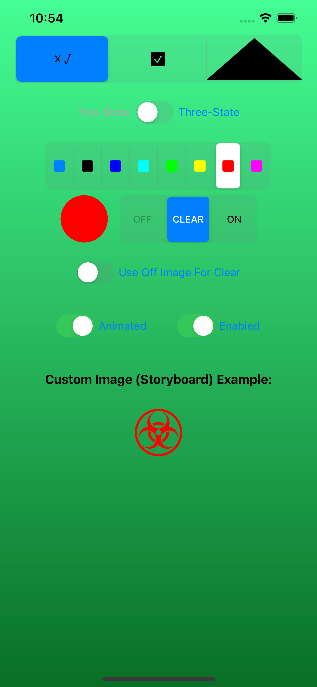

Although not required to implement `RVS_Checkbox`, the Test Harness App is useful for demonstrating its capabilities, and providing guidance in employing the control.

It is strongly suggested that, if you have any questions or concerns with the implementation of `RVS_Checkbox`, you begin by running the test harness, and examining its codebase.

The app, itself, is extremely simple. It is a single-screen iOS app that will run on iPods, iPhones, and iPads.

It is a [`UIKit`](https://developer.apple.com/documentation/uikit)-based app, using a [storyboard](https://developer.apple.com/library/archive/documentation/General/Conceptual/Devpedia-CocoaApp/Storyboard.html) ([Interface Builder](https://developer.apple.com/xcode/interface-builder/https://developer.apple.com/xcode/interface-builder/)).

[This is the Test Harness App Location in the GitHub Repo](https://github.com/RiftValleySoftware/RVS_Checkbox/tree/main/TestHarness/RVS_Checkbox_TestHarness)

### <a id="TARGETS"></a>App Build Targets

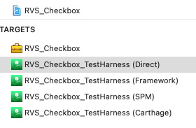

There are four app targets, in addition to the framework target (RVS_Checkbox). All targets share source, with the exception of the Direct and Carthage targets. They use the same source code, but a separate storyboard. This is because their implementation of `RVS_Checkbox` is compiled directly into the app, so there is no separate module.

#### <a id="TARGETS-DIRECT"></a>[RVS_Checkbox_Test_Harness (Direct)](https://github.com/RiftValleySoftware/RVS_Checkbox/blob/main/TestHarness/RVS_Checkbox_TestHarness/Info-Direct.plist)

This target directly imports [the `RVS_Checkbox.swift` file](https://github.com/RiftValleySoftware/RVS_Checkbox/blob/main/Sources/RVS_Checkbox/RVS_Checkbox.swift) into the project, with no package manager or library/framework. The file is compiled in the app namespace.

#### <a id="TARGETS-FRAMEWORK"></a>[RVS_Checkbox_Test_Harness (Framework)](https://github.com/RiftValleySoftware/RVS_Checkbox/blob/main/TestHarness/RVS_Checkbox_TestHarness/Info.plist)

This target uses the built-in [RVS_Checkbox](https://github.com/RiftValleySoftware/RVS_Checkbox/blob/main/Sources/Meta/Info.plist) dynamic framework target to build the framework, and imports that dylib into the project.

#### <a id="TARGETS-SPM"></a>[RVS_Checkbox_Test_Harness (SPM)](https://github.com/RiftValleySoftware/RVS_Checkbox/blob/main/TestHarness/RVS_Checkbox_TestHarness/Info-SPM.plist)

This target uses [the Swift Package Manager](https://swift.org/package-manager/) to import the package from [its location in GitHub](https://github.com/RiftValleySoftware/RVS_Checkbox). This is the preferred method of employing `RVS_Checkbox` in your project.

#### <a id="TARGETS-CARTHAGE"></a>[RVS_Checkbox_Test_Harness (Carthage)](https://github.com/RiftValleySoftware/RVS_Checkbox/blob/main/TestHarness/RVS_Checkbox_TestHarness/Info-Carthage.plist)

This target uses [GitHub Carthage](https://github.com/Carthage/Carthage) to fetch the package from [its location in GitHub](https://github.com/RiftValleySoftware/RVS_Checkbox). It then directly includes  [the `RVS_Checkbox.swift` file](https://github.com/RiftValleySoftware/RVS_Checkbox/blob/main/Sources/RVS_Checkbox/RVS_Checkbox.swift) from the `Carthage` directory, into the project, with no library/framework. The file is compiled in the app namespace.

### <a id="SCHEMES"></a>App Run Schemes

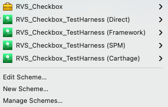

There are four run schemes to go with each target.

### <a id="TEST-DEP"></a>Dependencies and Requirements

Depending upon which target, the `RVS_Checkbox` framework/source file may be a dependency.

All targets are dependent upon [the `RVS_Generic_Swift_Toolbox` Package](https://github.com/RiftValleySoftware/RVS_Generic_Swift_Toolbox), using [the Swift Package Manager](https://swift.org/package-manager/).
