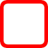

# RVS_Checkbox

## INTRODUCTION
This project is a robust, Swift-only, high-quality, "drop-in replacement" for the traditional [`UISwitch`](https://developer.apple.com/documentation/uikit/uiswitch), provided by Apple. It derives from [`UISwitch`](https://developer.apple.com/documentation/uikit/uiswitch), and provides almost exactly the same API as [`UISwitch`](https://developer.apple.com/documentation/uikit/uiswitch).

It is implemented with no dependencies.

Integrating RVS_Checkbox into your application is as simple as adding a [`UISwitch`](https://developer.apple.com/documentation/uikit/uiswitch) or [`UIView`](https://developer.apple.com/documentation/uikit/uiview) in [Interface Builder](https://developer.apple.com/xcode/interface-builder/https://developer.apple.com/xcode/interface-builder/), and specifying it to be an instance of [`RVS_Checkbox`](https://github.com/RiftValleySoftware/RVS_Checkbox).

You may also create instances of [`RVS_Checkbox`](https://github.com/RiftValleySoftware/RVS_Checkbox) programmatically.

[This is the online project documentation for this project](https://riftvalleysoftware.github.io/RVS_Checkbox/)

## WHAT PROBLEM DOES THIS SOLVE?
The classic [`UISwitch`](https://developer.apple.com/documentation/uikit/uiswitch):

Is a great UI element, and is used in place of the classic ["checkbox"](https://developer.apple.com/documentation/appkit/nsbutton) for Mac:

Which doesn't actually work as well, in the "fat finger" world of iOS UI.
### So, What's the Problem?
The issue is that the [`UISwitch`](https://developer.apple.com/documentation/uikit/uiswitch) is a big, rather awkwardly-shaped element. It is "lozenge"-shaped, and always horizontal, so can require a bit of creativity, when it comes to fitting it into a UI. Also, it has a specific design aesthetic, and can be difficult to customize *(to be fair, Apple doesn't encourage us to customize **ANY** UI, so that's no surprise).*

Because of the horizontal aspect of the control, it is fairly "natural" to have the label to the left:

...or the right:

But it looks "awkward" to have it below the switch:

This is especially true, if you use "label buttons," like I do (run the test harness, to see them in action).
It is also a bit "weird," as the slider appearance seems to ask for a swipe gesture, as opposed to a tap gesture (which is really what we want). That means that the gesture also requires some "mental runway."
The [`RVS_Checkbox`](https://github.com/RiftValleySoftware/RVS_Checkbox) allows a square aspect, and a directionless (tap) affordance, like a regular checkbox.

[`UISwitch`](https://developer.apple.com/documentation/uikit/uiswitch) also has a strictly "binary" action. If you have three choices, you are expected to use a [`UISegmentedControl`](https://developer.apple.com/documentation/uikit/uisegmentedcontrol), which is actually quite sensible. Apple obviously put a lot of research into their UX, and there's a good reason for this. Mobile interfaces are a compromise, at best.

### Why Does the RVS_Checkbox Solve This Problem?
Glad you asked. The [`RVS_Checkbox`](https://github.com/RiftValleySoftware/RVS_Checkbox) comes with a "built-in" appearance: A fairly "classic" appearance that uses the built-in [SF Symbols](https://developer.apple.com/design/human-interface-guidelines/sf-symbols/overview/) to mimic the way the Mac checkboxes appear.

You can also add your own images.

Additionally, [`RVS_Checkbox`](https://github.com/RiftValleySoftware/RVS_Checkbox) brings the "three-state" checkbox that is found in the Mac, to iOS. That means it is possible to have an "OFF," "ON," and "indeterminate" mode (I call it "CLEAR"). The default appearence is the circular checkbox, and the default mode is "binary," like [`UISwitch`](https://developer.apple.com/documentation/uikit/uiswitch).

Here are what the images look like (the color is controlled by the [`tintColor` property](https://developer.apple.com/documentation/uikit/uiview/1622467-tintcolor) of the control):
<table style="text-align:center">
    <thead>
        <tr>
            <td>&nbsp;</td>
            <td><strong>Default SF Symbols (TINTED RED)</strong></td>
            <td><strong>User-Provided (TEMPLATE)</strong></td>
            <td><strong>User-Provided (FULL COLOR)</strong></td>
        </tr>
    </thead>
    <tbody>
    <tr>
        <td><strong>ON</strong></td>
        <td></td>
        <td></td>
        <td></td>
    </tr>
    <tr>
        <td><strong>OFF</strong></td>
        <td></td>
        <td></td>
        <td></td>
    </tr>
    <tr>
        <td><strong>CLEAR</strong></td>
        <td></td>
        <td></td>
        <td></td>
    </tr>
    </tbody>
</table>

The "Default" images are [SF Symbols](https://developer.apple.com/sf-symbols/) images, that are "baked into" the class, and the "User-Provided" images are three arbitrary images that can be added in the storyboard, or assigned directly. They can be template, or full-color.

The images will resize with the control, but will retain their aspect (Aspect fit mode).

> NOTE: Only [`.alwaysTemplate`](https://developer.apple.com/documentation/uikit/uiimage/renderingmode-swift.enum/alwaystemplate) images will be displayed as tinted.

## REQUIREMENTS

[`RVS_Checkbox`](https://github.com/RiftValleySoftware/RVS_Checkbox) is a [`UIKit`](https://developer.apple.com/documentation/uikit)/[Cocoa Touch](https://developer.apple.com/library/archive/documentation/General/Conceptual/DevPedia-CocoaCore/Cocoa.html) [framework](https://developer.apple.com/library/archive/documentation/MacOSX/Conceptual/BPFrameworks/Concepts/WhatAreFrameworks.html) [UIControl](https://developer.apple.com/documentation/uikit/uicontrol).

It is designed for native [Swift](https://swift.org) application development.

This requires [iOS](https://apple.com/ios)/[iPadOS](https://apple.com/ipados) version 17.0 or above.

## DEPENDENCIES

There are no dependencies for the module. If you will be running [the test harness](https://github.com/RiftValleySoftware/RVS_Checkbox/tree/main/TestHarness/RVS_Checkbox_TestHarness), you will need to load [the RVS_Generic_Swift_Toolbox project](https://github.com/RiftValleySoftware/RVS_Generic_Swift_Toolbox), as well.

> NOTE: The [the RVS_Generic_Swift_Toolbox project](https://github.com/RiftValleySoftware/RVS_Generic_Swift_Toolbox) is only for the test harness. The control, itself, has no dependencies.

## INSTALLATION

The control is provided as a [Swift Package Manager](https://swift.org/package-manager/) package, and can also be installed using [Carthage](https://github.com/Carthage/Carthage).

The URL for the SPM module, is [git@github.com:RiftValleySoftware/RVS_Checkbox.git](git@github.com:RiftValleySoftware/RVS_Checkbox.git).

Once the package has been added to your project, remember to import it, when you use it:

    import RVS_Checkbox

If you are using Carthage, then you should add the following line to your [Cartfile](https://github.com/Carthage/Carthage/blob/master/Documentation/Artifacts.md#cartfile):

    github "RiftValleySoftware/RVS_Checkbox"

Then, open Terminal, and navigate to the top of the project directory, and type this into Terminal:

    carthage update
    
It will create a directory at the same level as the Cartfile, called "Carthage." Inside of this directory, will be another directory, called "Checkouts." Inside of that directory, will be another one, called "RVS_Checkbox." You want to go into "Sources/RVS_Checkout," and access [the RVS_Checkbox.swift file](https://github.com/RiftValleySoftware/RVS_Checkbox/blob/main/Sources/RVS_Checkbox/RVS_Checkbox.swift). Drag a reference to this into your project, and associate it with your app build target.

Once you have the reference, then you won't need to import the module.

## USAGE

### Storyboard Usage

In Interface Builder/Storyboard Editor, simply drag in a [`UISwitch`](https://developer.apple.com/documentation/uikit/uiswitch) or [`UIView`](https://developer.apple.com/documentation/uikit/uiview) reference, and rename the class to "`RVS_Checkbox`." The inspectable elements should be immediately available in the Attributes Inspector.

### Manifest for the Attributes Inspector Screen:

- On Image: An image that is displayed as the control, when it is "On."

- Off Image: An image that is displayed as the control, when it is "Off."

- Clear Image: An image that is displayed as the control, when it is "Clear" (as a three-state).

- Is Three-State: If this is On (default is Off), then the switch will have three states: "On," "Off," and "Clear." If it is off, then the control will only have "On," and "Off."

- Use Off Image: If this is On (default is Off, unless no Clear Image is provided), then, when a three-state control displays a "Clear" state, it will use the "Off" Image.

- Use Haptics: If this is On (Default is On), then the control will use subtle haptics, just like the [`UISwitch`](https://developer.apple.com/documentation/uikit/uiswitch). If set programmatically, haptics are not executed.

If you do not supply at least both an On Image and an Off Image, the default SF Symbols will be used.

> NOTE: A "Clear" image is not required, and is only used when in three-state. If it is not supplied, and the control is in three-state, Use Off Image will be On.
>
> It is also possible to [programmatically disable display of custom images](https://github.com/RiftValleySoftware/RVS_Checkbox/blob/main/Sources/RVS_Checkbox/RVS_Checkbox.swift#L302).

It also has the standard [`UISwitch`](https://developer.apple.com/documentation/uikit/uiswitch) attributes, but "On Tint" and "Thumb Tint" are ignored.

> NOTE: You can't set a "Clear" state from the Attributes Inspector. That must be done programmatically. You can set "On" or "Off," however, using the "State" attribute.

You use the [`UIView.tintColor`](https://developer.apple.com/documentation/uikit/uiview/tintcolor) to set the color of template images (or the default SF Symbols version).

You cannot set different colors, for different states (but you can use custom full-color images).

### Programmatic Usage

You should create an instance of [the `RVS_Checkbox` class](https://github.com/RiftValleySoftware/RVS_Checkbox) (or a subclass that you define). It can have the same init arguments as [`UISwitch`](https://developer.apple.com/documentation/uikit/uiswitch).

> NOTE: We do not save or load extra parameters for the coder init. It is the same as for [`UISwitch`](https://developer.apple.com/documentation/uikit/uiswitch/init\(coder:\)).

Once the class has been instantiated, you can add images, set states, or set it into an AutoLayout position (as with any other [`UIView`](https://developer.apple.com/documentation/uikit/uiview) subclass).

Examples of both types of usage are available in [the test harness app](https://github.com/RiftValleySoftware/RVS_Checkbox/tree/main/TestHarness/RVS_Checkbox_TestHarness).

## LICENSE

MIT License

Permission is hereby granted, free of charge, to any person obtaining a copy of this software and associated documentation
files (the "Software"), to deal in the Software without restriction, including without limitation the rights to use, copy,
modify, merge, publish, distribute, sublicense, and/or sell copies of the Software, and to permit persons to whom the
Software is furnished to do so, subject to the following conditions:

The above copyright notice and this permission notice shall be included in all copies or substantial portions of the Software.

THE SOFTWARE IS PROVIDED "AS IS", WITHOUT WARRANTY OF ANY KIND, EXPRESS OR IMPLIED, INCLUDING BUT NOT LIMITED TO THE WARRANTIES
OF MERCHANTABILITY, FITNESS FOR A PARTICULAR PURPOSE AND NONINFRINGEMENT.
IN NO EVENT SHALL THE AUTHORS OR COPYRIGHT HOLDERS BE LIABLE FOR ANY CLAIM, DAMAGES OR OTHER LIABILITY, WHETHER IN AN ACTION OF
CONTRACT, TORT OR OTHERWISE, ARISING FROM, OUT OF OR IN CONNECTION WITH THE SOFTWARE OR THE USE OR OTHER DEALINGS IN THE SOFTWARE.

[The Great Rift Valley Software Company: https://riftvalleysoftware.com](https://riftvalleysoftware.com)
